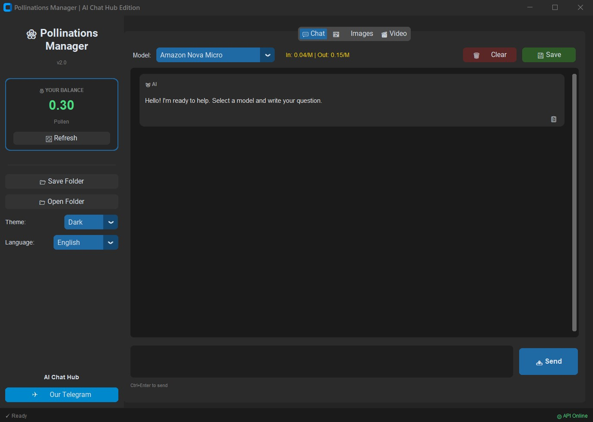
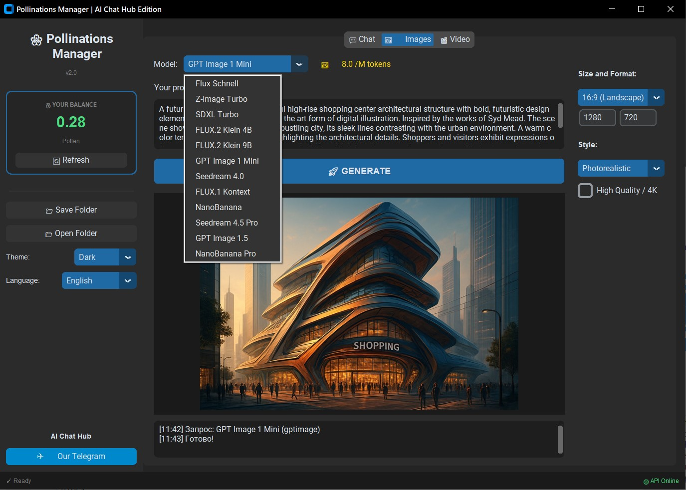
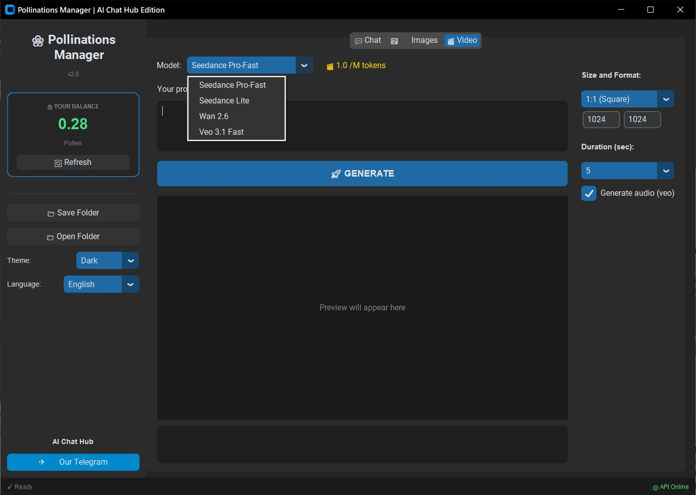

# Pollinations Manager

<div align="center">


**A modern desktop GUI application for Pollinations.ai API**

Generate images, videos, and chat with AI models - all in one beautiful interface.

[Features](#features) | [Demo](#demo) | [Installation](#installation) | [Get API Key](#getting-your-api-key) | [Usage](#usage) | [Languages](#supported-languages)

</div>

---

## Demo

<div align="center">


[](https://www.youtube.com/watch?v=MujsACBwIAw)

</div>

---

## Screenshots

<div align="center">

| Chat | Image Generation | Video Generation |
|:---:|:---:|:---:|
|  |  |  |

</div>

---

## Features

### AI Chat
- Multiple AI models (GPT-5, Claude, Gemini, DeepSeek, and more)
- Full conversation history
- Save chat to file
- Copy messages to clipboard
- Real-time token pricing display

### Image Generation
- 12+ image models (Flux, SDXL, GPT Image, NanoBanana, etc.)
- Multiple sizes and formats (PNG, JPG, WebP)
- 10 artistic styles (Cinematic, Anime, Cyberpunk, etc.)
- Auto-save to folder
- Image preview

### Video Generation
- 4 video models (Seedance, Wan, Veo)
- Adjustable duration (5-10 seconds)
- Audio generation support
- High quality / 4K option

### General
- Modern dark/light theme
- 11 interface languages
- Balance tracking (Pollen credits)
- Keyboard shortcuts (Ctrl+Enter, Ctrl+V with any keyboard layout)
- Auto-save settings

---

## Installation

### Prerequisites

- **Python 3.10 or higher** - [Download Python](https://www.python.org/downloads/)
  > Make sure to check **"Add Python to PATH"** during installation!

### Quick Install (Windows)

1. **Download or clone the repository:**
   ```bash
   git clone https://github.com/doctorm333/pollinations-manager.git
   cd pollinations-manager
   ```

2. **Run the installer:**
   ```bash
   install.bat
   ```

3. **Start the app:**
   ```bash
   run.bat
   ```

### Quick Install (macOS / Linux)

1. **Download or clone the repository:**
   ```bash
   git clone https://github.com/doctorm333/pollinations-manager.git
   cd pollinations-manager
   ```

2. **Make scripts executable and run installer:**
   ```bash
   chmod +x install.sh run.sh
   ./install.sh
   ```

3. **Start the app:**
   ```bash
   ./run.sh
   ```

> **Note for macOS:** If you see a security warning, go to System Preferences → Security & Privacy and allow the app.

> **Note for Linux:** You may need to install tkinter: `sudo apt install python3-tk` (Ubuntu/Debian) or `sudo dnf install python3-tkinter` (Fedora)

### Manual Install (All Platforms)

1. **Clone the repository:**
   ```bash
   git clone https://github.com/doctorm333/pollinations-manager.git
   cd pollinations-manager
   ```

2. **Create virtual environment:**
   ```bash
   python -m venv venv

   # Windows
   venv\Scripts\activate

   # macOS/Linux
   source venv/bin/activate
   ```

3. **Install dependencies:**
   ```bash
   pip install -r requirements.txt
   ```

4. **Run the application:**
   ```bash
   python main.py
   ```

### Dependencies

| Package | Version | Purpose |
|---------|---------|---------|
| customtkinter | >= 5.2.0 | Modern UI framework |
| requests | >= 2.28.0 | HTTP client for API |
| Pillow | >= 9.0.0 | Image processing |

---

## Getting Your API Key

To use all features, you need a **free API key** from Pollinations.ai:

### Step 1: Visit Pollinations.ai

Go to [https://pollinations.ai](https://pollinations.ai)

### Step 2: Create an Account

1. Click **"Sign Up"** or **"Log In"** (you can use Google, GitHub, or email)
2. Complete the registration process

### Step 3: Get Your API Key

1. After logging in, go to your **Dashboard** or **Account Settings**
2. Navigate to **"API Keys"** or **"Developer"** section
3. Click **"Create New API Key"** or **"Generate Key"**
4. Copy your API key (it looks like: `pln_xxxxxxxxxxxxxxxxxxxx`)

### Step 4: Add Key to App

1. Open **Pollinations Manager**
2. Paste your API key in the **"API Key"** field in the sidebar
3. Press **Enter** or click outside the field
4. Your balance will appear showing your Pollen credits

### Free Tier

Pollinations.ai offers a **generous free tier**:
- Free credits for new accounts
- Low-cost generation (images from 0.0002 Pollen)
- No credit card required

> **Note:** Your API key is stored locally in `config.json` and is never shared.

---

## Usage

### Basic Workflow

1. **Enter your API key** in the sidebar
2. **Select a tab**: Chat, Images, or Video
3. **Choose a model** (prices shown next to each model)
4. **Enter your prompt**
5. **Click Generate** or press `Ctrl+Enter`

### Keyboard Shortcuts

| Shortcut | Action |
|----------|--------|
| `Ctrl+Enter` | Send message / Generate |
| `Ctrl+V` | Paste (works with any keyboard layout) |
| `Ctrl+C` | Copy |
| `Ctrl+A` | Select all |

### Configuration

Settings are automatically saved to `config.json`:

```json
{
    "api_key": "your_api_key",
    "save_folder": "pollinations_results",
    "language": "en"
}
```

You can also copy `config.example.json` to `config.json` and edit it manually.

---

## Supported Languages

The interface is available in **11 languages**:

| Language | Code | Native Name |
|----------|------|-------------|
| English | `en` | English |
| Russian | `ru` | Русский |
| German | `de` | Deutsch |
| French | `fr` | Français |
| Japanese | `ja` | 日本語 |
| Portuguese | `pt` | Português |
| Spanish | `es` | Español |
| Italian | `it` | Italiano |
| Polish | `pl` | Polski |
| Turkish | `tr` | Türkçe |
| Arabic | `ar` | العربية |

Change language in **Settings** (sidebar) → restart the app.

---

## Project Structure

```
pollinations-manager/
├── main.py              # Main application
├── requirements.txt     # Python dependencies
├── config.example.json  # Configuration template
├── install.bat          # Windows installer
├── install.sh           # macOS/Linux installer
├── run.bat              # Windows launcher
├── run.sh               # macOS/Linux launcher
├── .gitignore           # Git ignore rules
├── LICENSE              # MIT License
├── README.md            # This file
├── CONTRIBUTING.md      # Contribution guidelines
└── assets/              # Screenshots and demo media
    ├── demo.gif
    ├── Screen1.jpg
    ├── Screen2.jpg
    └── Screen3.jpg
```

---

## Troubleshooting

### "Python is not recognized"
- Reinstall Python with **"Add Python to PATH"** checked
- Or manually add Python to your system PATH

### "Module not found" errors
- Make sure you activated the virtual environment
- Run `pip install -r requirements.txt` again

### API returns 401 Unauthorized
- Check that your API key is correct
- Make sure you're logged in at pollinations.ai
- Try generating a new API key

### Ctrl+V doesn't work
- This app supports paste with any keyboard layout
- If still not working, try right-click → Paste

---

## Contributing

Contributions are welcome! Please read [CONTRIBUTING.md](CONTRIBUTING.md) for guidelines.

### Ways to Contribute

- Report bugs and issues
- Suggest new features
- Add new translations
- Improve documentation
- Submit pull requests

---

## License

This project is licensed under the **MIT License** - see the [LICENSE](LICENSE) file for details.

---

## Acknowledgments

- [Pollinations.ai](https://pollinations.ai) - AI generation API
- [CustomTkinter](https://github.com/TomSchimansky/CustomTkinter) - Modern UI library
- [AI Chat Hub](https://t.me/+SSC4B1Dnrlc2ZTky) - Community & Support

---

<div align="center">

**Made with love by AI Chat Hub**

[](https://t.me/+SSC4B1Dnrlc2ZTky)

</div>
